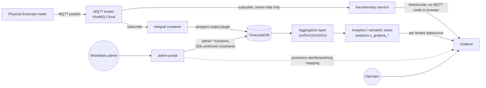

# Telemetry Platform

Status: CURRENT · Last reviewed: 2026-08-30 (basis: staging live verification + repository) · Owner: Engineering
Source of truth: platform manual chapters 02, 05–11, 16 (archived), consolidated here.

## Component and data-flow diagram

`admin-portal` and `live-telemetry` are two `command:` variants of the same
built application image — see
[../deployment/README.md](../deployment/README.md).

## Layer summary

1. **Physical device → MQTT**: Eniscope meters publish JSON payloads keyed
   by a physical `MQTT_UID` to the broker — a real physical fact, never
   regenerated per environment.
2. **Telegraf**: subscribes and writes raw messages into TimescaleDB.
   Stateless — no device/tenant knowledge.
3. **Database — raw/normalized**: raw JSON lands in `telemetry.raw_messages`;
   normalization resolves `MQTT_UID → metadata.device_identifiers →
   metadata.devices → metadata.gateways` and applies the device's profile's
   field mapping to produce `telemetry.normalized_points`. See
   [data-model.md](data-model.md) and [pipeline.md](pipeline.md).
4. **Aggregation**: TimescaleDB continuous aggregates plus a separate
   persisted/validated "semantic" layer at 1m/5m/15m/1h/1d. See
   [aggregation.md](aggregation.md).
5. **Analytics/semantic layer**: `analytics.v_grafana_*` views resolve
   organisation/site/asset/device identity for tenant-scoped presentation.
   See [analytics-layer.md](analytics-layer.md).
6. **Grafana**: per-tenant datasource provisioned at runtime; dashboards
   query the semantic layer, not raw telemetry directly. See
   [../grafana/README.md](../grafana/README.md).
7. **admin-portal**: the only intended write path for tenant/site/device/
   asset metadata in normal operation. See
   [onboarding-and-commissioning.md](onboarding-and-commissioning.md).

## "Where to Look" — source-of-truth map

| Question | Authoritative source |
|---|---|
| How does the architecture fit together? | This directory + [../../04-architecture/](../../04-architecture/) |
| Exact database schema | `postgres/ddl/`, `postgres/migrations/` |
| Reference/seed data | `postgres/seeds/reference/` |
| Grafana dashboards, provisioning | `grafana/` |
| Container topology, healthchecks, volumes, ports | `compose.yaml` |
| CI/CD pipeline | `.github/workflows/` + [../../09-release-and-deployment/ci-cd.md](../../09-release-and-deployment/ci-cd.md) |
| Historical investigations, past incidents | [../../99-archive/](../../99-archive/) — historical, not current truth |
| Current runtime state | The live staging/production database, queried read-only |

## A concrete example of repo-vs-live drift

An early check of staging's triggers, run as the `ems_readonly` role,
returned zero rows from `information_schema.triggers` for the `metadata`
schema. Re-run as `ems_admin`, the same schema showed 12 active triggers
across `assets`, `devices`, and `asset_devices`, several of which aren't
present anywhere in the repository's DDL history at all — see
[../../04-architecture/security-and-tenancy.md](../../04-architecture/security-and-tenancy.md).
This is why *repository expectation* and *live-verified current
implementation* must be checked separately.

## In this directory

- [pipeline.md](pipeline.md) — the physical-device-to-Grafana data path, stage by stage, with watermark/bounded-catchup/reconciliation detail.
- [aggregation.md](aggregation.md) — the five resolutions, and why one can legitimately be empty.
- [analytics-layer.md](analytics-layer.md) — the semantic/business-analytics layer between raw telemetry and Grafana.
- [data-model.md](data-model.md) — organization → site → gateway → device → asset, and the asset model.
- [onboarding-and-commissioning.md](onboarding-and-commissioning.md) — how a device gets created, wired up, and commissioned.
