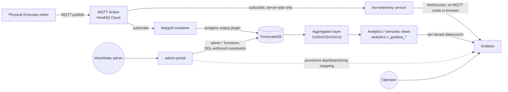

# Architecture

Status: CURRENT
Last verified: 2026-08-24
Verification basis: Repository, Staging, Production read-only

## Component and data-flow diagram

`admin-portal` and `live-telemetry` are two `command:` variants of the same
built application image (`app/Dockerfile`) — see
[04-docker-services.md](04-docker-services.md).

## Layer summary

1. **Physical device → MQTT**: Eniscope meters publish JSON payloads keyed
   by a physical `MQTT_UID` (a colon-separated 8-byte hex identifier, e.g.
   `80:34:28:16:22:fe:00:01`) to the broker. This identifier is a real
   physical fact and is never regenerated per environment — see
   [15-mqtt-and-telegraf.md](15-mqtt-and-telegraf.md).
2. **Telegraf**: subscribes and writes raw messages into TimescaleDB.
   Stateless — no device/tenant knowledge.
3. **Database — raw/normalized**: raw JSON lands in `telemetry.raw_messages`;
   normalization resolves `MQTT_UID → metadata.device_identifiers →
   metadata.devices → metadata.gateways` and applies the device's profile's
   field mapping to produce `telemetry.normalized_points`. See
   [05-database.md](05-database.md) and [07-telemetry-pipeline.md](07-telemetry-pipeline.md).
4. **Aggregation**: TimescaleDB continuous aggregates (`telemetry.ca_energy_*`)
   plus a separate persisted/validated "semantic" layer
   (`analytics.energy_consumption_*`) at 1m/5m/15m/1h/1d. See
   [11-aggregation.md](11-aggregation.md).
5. **Analytics/semantic layer**: `analytics.v_grafana_*` views resolve
   organization/site/asset/device identity for tenant-scoped presentation.
   See [10-analytics.md](10-analytics.md).
6. **Grafana**: per-tenant datasource provisioned at runtime via
   `metadata.grafana_organization_map`; dashboards query the semantic
   layer, not raw telemetry directly. See [12-grafana.md](12-grafana.md).
7. **admin-portal**: the only intended write path for tenant/site/device/asset
   metadata in normal operation, enforcing checks in `admin.*` functions
   *in addition to* database-level constraints/triggers. See
   [08-device-onboarding.md](08-device-onboarding.md) and
   [13-admin-portal.md](13-admin-portal.md).

## "Where to Look" — source-of-truth map

| Question | Authoritative source |
|---|---|
| How does the architecture fit together? | `docs/platform-manual/` (this manual) |
| Exact database schema (tables, columns, constraints, triggers) | `postgres/ddl/`, `postgres/migrations/` |
| Reference/seed data (protocols, device profiles, categories) | `postgres/seeds/reference/` |
| Grafana dashboards, provisioning | `grafana/` |
| Container topology, healthchecks, volumes, ports | `compose.yaml` |
| CI/CD pipeline | `.github/workflows/` + `docs/operations/CICD_PIPELINE.md` |
| Historical investigations, past incident analysis | `Audit/` — **historical**, not current truth; check whether findings were superseded (see [23-known-issues-and-drift.md](23-known-issues-and-drift.md) and [25-change-history.md](25-change-history.md)) |
| Current runtime state (row counts, live telemetry, commissioning status) | The live staging/production database, queried read-only — **not** any static document, including this manual |

## A concrete example of repo-vs-live drift

This session's own work surfaced a direct example worth internalizing: an
early check of staging's triggers, run as the `ems_readonly` role, returned
zero rows from `information_schema.triggers` for the `metadata` schema.
The conclusion "staging has zero triggers" was reported, then found to be
wrong — re-run as `ems_admin`, the same schema showed 12 active triggers
across `assets`, `devices`, and `asset_devices`, several of which aren't
present anywhere in the repository's DDL history at all (e.g.
`metadata.validate_asset_physical_location`, which enforces that an
asset's `building_id`/`floor_id` must be set whenever `space_id` is set —
this rule exists live on staging but has no corresponding migration file
in the repository). This is why this manual insists on distinguishing
*repository expectation* from *live-verified current implementation*
everywhere, and why a "the repo doesn't show it" conclusion about live
behavior needs a live check with sufficient privilege, not an assumption.
